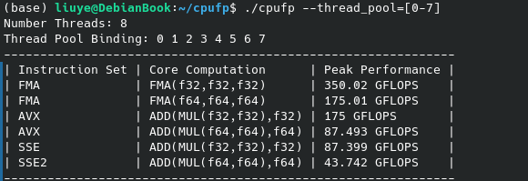
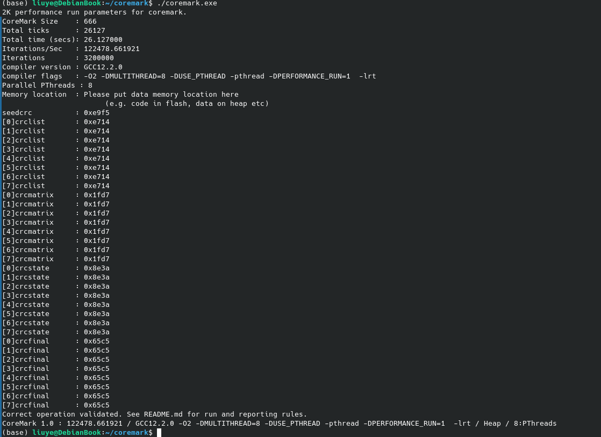
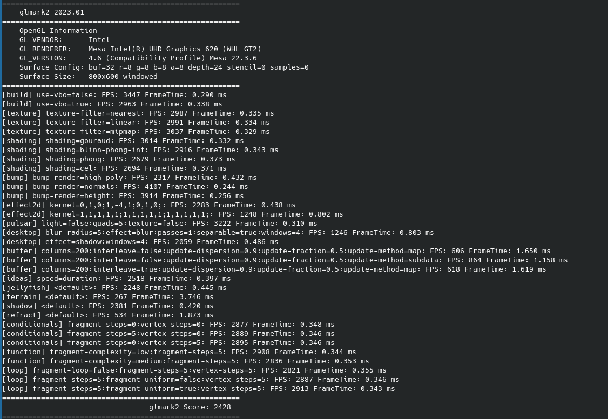

# 富士通 U939

本人之前手里拿的是一台华硕的天选 4 锐龙版，虽然性能强劲，续航也还不错（不过也常常为 Zen4 居高不下的 uncore 功耗而苦恼），但是它 1.9kg 的重量，即使是最初购买时已经挑的全能本，也让我在是否带它出门这件事情上犹豫不决。加上作为 CS 学生，Windows 总归是不太得劲，身边的赋格同学们则是不少果断入手了 Macbook。然而，Macbook 的售价实在让人望而却步，于是我就开始寻找一款轻薄本，既能满足我的需求，又能在重量和续航上做到 Macbook 的体验。

于是我想搞 Debianbook 这种东西：性能不需要多强，能开浏览器、vscode 和 QQ 就好；轻薄且续航好；足够廉价。起初为了续航和轻薄我试图选择用 ARM 的开发板来实现我的 Debianbook。但是在经过一番选型之后，我没能找到 IO 方面完全适合我的开发板；而且即使满足，开发板的 soc 普遍架构和工艺都挺老的，之前我在一块 1GB 内存的香橙派 Zero3 上尝试着装过 KDE 的 Armbian，但是发现性能也只能说勉强（指不会把桌面卡成 PPT 而已），而且貌似 kde 和 ARM 的兼容性还有点问题，Qt5 的某些服务不知道为啥就是起不来。

在 x86 阵营这边，虽然之前注意到日产洋垃圾在这方面能做到不错，但是由于之前看见的产品都透露着一种奇奇怪怪的感觉（比如有些奇奇怪怪的触控板），所以一直没有入手。Debianbook 项目陷入了停滞。

24'Q3 开头的时候，我去武汉参加一个比赛，带的是我的天选 4。即使是作为一个已经比较轻的全能本，我依然觉得背着它出差是一件非常不方便的事情，而且 16 寸的大块头也导致移动办公变得十分困难。直到在武汉比赛完的那天下午，朋友突然给我发来一个黄鱼的连接。我一看，好家伙，基于 Whisky Lake 的 4 核处理器，900g 的重量，50wh 的大电池，镁铝合金机身结实又耐看，关键 8+128 价格只要 850。这可不就是我心心念念好久的“Debianbook”的完美选择吗？而且这接口也实在是丰富：2 个 USB3.1 的 Type-C 接口，两个 USB3.0 的 Type-A 接口，一个折叠式 RJ45 网口，一个 HDMI 接口，一个 3.5mm 耳机口，还有一个 SD 卡读卡器。这接口甚至比手里的天选 4 接口还丰富啊！（此处要吐槽一下，明明加几个 USB 接口又没啥成本又不会增加什么重量，为啥一堆厂商就是不愿意给）。

在挑选了一番店家之后，我很快下了单

由于这款笔记本被我称为“Debianbook”，所以接下来我会尽量以 Debian 的视角来评价这款笔记本

首先是 cpufp 测试：

接下来是 coremark 测试：

gpu 方面，使用 glmark2 进行测试：

续航方面，我安装了 tlp 来帮助功耗管理
